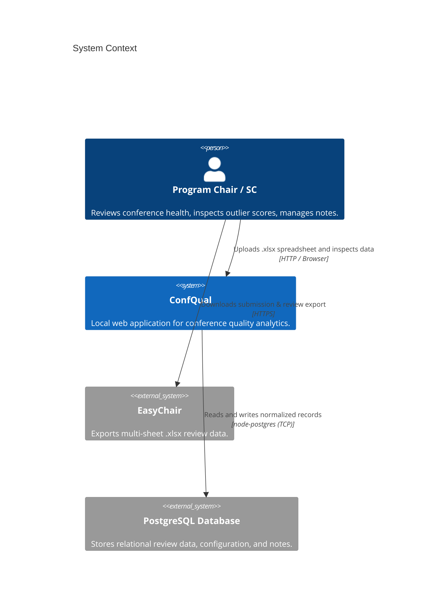
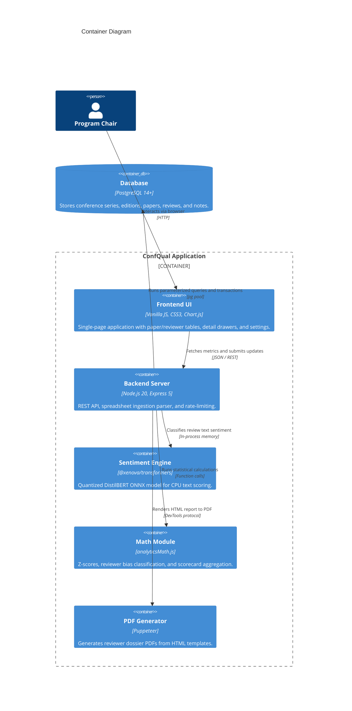
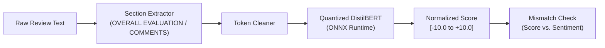
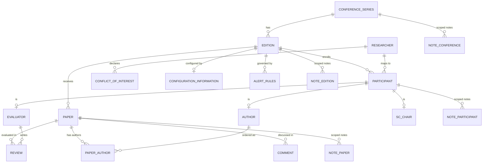

# ConfQual System Architecture

ConfQual is a local web tool for academic Program Chairs, Track Chairs, and Steering Committees. It analyzes review datasets exported from peer-review management systems (primarily EasyChair) to inspect reviewer calibration, score variance, discussion activity, and conference ranking criteria (such as CORE and GII-GRIN-SCIE).

---

## 1. System Overview & Problem Context

Peer-review systems like EasyChair manage submission intake, reviewer assignments, and review collection. However, chairs typically have to export spreadsheets to answer basic quality questions:
- Are certain reviewers consistently harsher or more lenient than their peers?
- Did any submissions receive conflicting reviews without follow-up committee discussion?
- Were papers reviewed by people outside the declared topic area?
- Does the acceptance rate and review distribution meet international conference baselines?

ConfQual runs locally on the chair's machine, parses the raw multi-sheet Excel export, calculates statistical quality metrics, runs sentiment checks on review text without sending data to external APIs, and maintains chair notes across multiple conference years.

---

## 2. High-Level Architecture

The system consists of a Node.js/Express backend, a PostgreSQL relational database, an in-process ONNX model for text classification, and a vanilla JavaScript frontend.

### 2.1 Context Diagram



### 2.2 Container Diagram



---

## 3. Data Privacy & Local Text Processing

Review text and author information are strictly confidential before decision notifications are published. ConfQual operates under specific privacy constraints:

1. **No External Network Calls**: All analytical and natural language processing tasks execute inside the Node process on localhost. No data is sent to external cloud APIs or third-party tracking services.
2. **Local NLP Classification**: Review text sentiment is evaluated on the CPU using `@xenova/transformers` with a quantized `distilbert-base-uncased-finetuned-sst-2-english` model running on the ONNX runtime.
3. **Database Anonymization Flag**: When the anonymization toggle is enabled, SQL queries mask author names, PC member identities, and email addresses (`maskNames`) before sending responses to the browser.



The extractor isolates evaluation text from standard boilerplate sections, runs the model, and scales the output to a range between `-10.0` (strongly critical) and `+10.0` (strongly positive). If a numerical score is high (e.g. $+2$) but sentiment is heavily negative, the review is marked for chair inspection.

---

## 4. Data Model & Database Schema

ConfQual separates multi-year **Conference Series** from annual **Editions**, allowing chairs to track returning reviewers and cross-edition notes over time.

### 4.1 Entity Relationships



### 4.2 Schema Design Details

- **`conference_series` & `edition`**: Groups annual iterations under one banner (e.g. `CAiSE` -> `2025`, `2026`).
- **`researcher`**: Global person record identified by name and email.
- **`participant_new`**: Connects a `researcher` to an `edition`, assigning an external ID from EasyChair.
- **`evaluator` / `author_new` / `sc_chair`**: Role tables referencing `participant_new`.
- **`paper_author_new`**: Maintains explicit author ordering (`author_order` = 1, 2, 3...).
- **`configuration_information`**: Stores 11 typed edition parameters (score ranges, reviewer count baseline, submission deadline, paper types).
- **`notes_*` Tables**: Independent tables for conference-wide notes, edition notes, and per-entity notes (papers, reviewers, reviews, comments).
- **`participant_topic`**: Many-to-many PC expertise (imported from “PC topics” sheet) — enables correct zero-overlap expertise alerts via `NOT EXISTS (paper_topic JOIN participant_topic)`.
- **`paper.decision_category`**: Constrained `CHECK (IN ('accept','reject','desk_reject','withdrawn','no_decision','no decision'))` normalized by `utils/decisionHelper.js`; `updatePaperDecision` also normalizes input.

### 4.3 Ingestion & Re-Import Behavior
Data import runs inside a single PostgreSQL transaction (`BEGIN` / `COMMIT`). The importer uses `ON CONFLICT (...) DO UPDATE` upserts:
- Existing submissions, authors, and reviews are updated if modified in the spreadsheet.
- User-created private notes, decision overrides, and custom alert thresholds are retained during re-import.
- Sub-reviewers are identified and linked to parent PC assignments.
- **Fast path:** `topicImporter` batch `ensureTopicsExist` (single `unnest` upsert), `bulkInsert` chunk 500, shared `paperMap/participantMap`, and deferred `sentiment_score` enrichment (`setImmediate` after COMMIT). `POST /api/analytics/process-conference` returns `202 {importId, pollUrl}` immediately; poll `GET /api/analytics/import-status/:id` (`running|done|error`). Heavy transformer inference no longer blocks HTTP.

---

## 5. Statistical Calculations & Metrics

### 5.1 Quality Scorecard Dimensions
The dashboard groups conference quality into four 0–100 scores:

1. **Coverage**:
   $$\text{Coverage} = \min\left(100, \frac{\text{Papers with } \ge N \text{ reviews}}{\text{Total Non-Desk-Rejected Submissions}} \times 100\right)$$
   Where $N$ comes from `configuration_information.nb_reviewers` (default: 3).

2. **Integrity**:
   $$100 - (20 \times \text{COI Violations} + 10 \times \text{Topic Mismatches} + 5 \times \text{Sentiment Mismatches})$$
   Floored at 0.

3. **Satisfaction**:
   $$\left(0.5 \times \text{Workload Equity} + 0.5 \times \frac{\text{Positive Bid Matches}}{\text{Total Assignments}}\right) \times 100$$

4. **Discussion**:
   $$\frac{\text{High-Variance Papers with Discussion Comments}}{\text{Total High-Variance Papers}} \times 100$$

### 5.2 Reviewer Calibration & Z-Score Normalization
To account for varying grading standards among reviewers:

$$\mu_{\text{reviewer}} = \frac{1}{K}\sum_{i=1}^{K} \text{Score}_i, \quad \sigma_{\text{reviewer}} = \sqrt{\frac{1}{K}\sum_{i=1}^{K}(\text{Score}_i - \mu_{\text{reviewer}})^2}$$

$$\text{Normalized Score} = \mu_{\text{conf}} + \left(\frac{\text{Score} - \mu_{\text{reviewer}}}{\sigma_{\text{reviewer}}}\right) \times \sigma_{\text{conf}}$$

- **Calibration Difference**: $\Delta = \mu_{\text{reviewer}} - \mu_{\text{conf}}$
- **Classification**:
  - `Calibrated`: $|\Delta| \le 0.50$
  - `Lenient`: $\Delta > +0.50$
  - `Strict`: $\Delta < -0.50$
  - `Extreme`: $|\Delta| > 1.50$

---

## 6. API Reference

### 6.1 Analytics & Exploration

| Method | Endpoint | Query Parameters | Description |
| :--- | :--- | :--- | :--- |
| `GET` | `/api/analytics/dashboard` | `conferenceId` | Overall scorecard metrics, alerts summary, and action items. |
| `GET` | `/api/analytics/papers` | `conferenceId`, `filter`, `sort`, `order`, `search` | Filtered list of papers with score variance, review counts, and decision status. |
| `GET` | `/api/analytics/papers/:id` | — | Detail record for a single submission including reviews, comments, and notes. |
| `PUT` | `/api/analytics/papers/:id/decision` | — | Updates chair decision status (`accept`, `reject`, `borderline`). |
| `GET` | `/api/analytics/reviewers` | `conferenceId`, `filter`, `sort`, `order`, `search` | Reviewer workload, completed/missed reviews, and calibration index. |
| `GET` | `/api/analytics/reviewers/:id` | `conferenceId` | Single reviewer profile with assigned papers and calibration stats. |
| `GET` | `/api/analytics/reviewers/:id/report` | `conferenceId`, `anonymize` | Generates a PDF dossier for the specified reviewer. |
| `GET` | `/api/analytics/quality-profile` | `conferenceId` | Computes CORE/GII-GRIN indicators (acceptance rate, review density, PC diversity; `count(DISTINCT participant_topic)` for expertise). |
| `GET` | `/api/analytics/alerts` | `conferenceId` | Returns active alerts based on configured thresholds (thresholds wired via `alertRuleDefaults` + `getAlertRules`). |
| `GET` | `/api/analytics/import-status/:id` | — | Poll async import (`running|done|error`) for `POST /process-conference` 202. |
| `GET` | `/api/analytics/papers` | `conferenceId, limit, offset, sort, order` | Paginated (analytics internal `LIMIT ALL`, UI `50/100 max`, deterministic `pt.id` tie-break). |
| `GET` | `/api/analytics/reviewers` | `conferenceId, limit, offset` | Paginated, calibration excludes solo-paper `NULL` and is edition-scoped. |

### 6.2 Settings & Configuration

| Method | Endpoint | Payload | Description |
| :--- | :--- | :--- | :--- |
| `GET` | `/api/analytics/configuration` | `conferenceId` | Fetches the 11 edition configuration attributes. |
| `PUT` | `/api/analytics/configuration` | `{ conferenceId, nb_reviewers, score_min, score_max, ... }` | Updates configuration attributes for the edition. |
| `GET` | `/api/analytics/alert-rules` | `conferenceId` | Fetches custom alert rule thresholds and enable flags. |
| `PUT` | `/api/analytics/alert-rules` | `{ conferenceId, rules: [...] }` | Saves customized alert rule thresholds. |

### 6.3 Notes Management

| Method | Endpoint | Payload | Description |
| :--- | :--- | :--- | :--- |
| `GET` | `/api/analytics/notes` | `conferenceId` or `editionId` | Fetches notes scoped to the conference series or edition. |
| `POST` | `/api/analytics/notes` | `{ conferenceId, entityType, entityId, text }` | Creates a note attached to a conference, edition, paper, or reviewer. |
| `PUT` | `/api/analytics/notes/:id` | `{ text }` | Updates note content. |
| `DELETE` | `/api/analytics/notes/:id` | — | Deletes a single note. |
| `DELETE` | `/api/analytics/notes/conference/:id`| — | Deletes all notes for a conference series. |
| `DELETE` | `/api/analytics/notes?editionId=:id`| — | Deletes all notes for an edition. |

---

## 7. Frontend Application Structure

The frontend is written in standard ES modules without third-party frameworks.

```text
backend/public/js/
├── app.js             # Initializes the application and loads initial dataset
├── state.js           # Shared state container
├── router.js          # URL hash parser for view, filter, and drawer state
├── events.js          # Global event bindings
├── tables.js          # Table rendering, column sorting, and multi-filter dropdowns
├── drawers.js         # Slide-over drawers for paper and reviewer details
├── settingsView.js    # Settings drawer, threshold sliders, and notes list
├── conferences.js     # Conference selector and comparison view
├── charts.js          # Chart.js rendering wrappers
└── tooltip.js         # Custom 120ms hover tooltips
```

- **URL Hash Synchronization**: View state (current tab, active conference, search term, active paper/reviewer drawer) is encoded into the URL hash, making views bookmarkable and shareable.
- **Preset Management**: Users can save filter combinations to local storage as named presets.
- **Event Delegation**: Drawers and tables use delegated event listeners to handle large lists without registering hundreds of individual DOM handlers.

---

## 8. Test Suite & Verification

The test suite runs using the native Node.js test runner (`node --test`).

```bash
# Run all tests (193, including golden alertMetrics + decisionHelper normalization)
npm test

# Run code style check
npm run lint
```

### Test Coverage Summary
- `analyticsMath.test.mjs`: Tests standard deviation, z-score transformations, peer calibration averages, and handling of edge cases (e.g. division by zero, missing reviews).
- `sentimentEngine.test.mjs`: Tests review section parsing, stopword filtering, batch classification, and discrepancy flagging.
- `noteScopingAndCrud.test.mjs`: Verifies cross-edition note inheritance and cross-conference isolation.
- `apiRoutes.test.mjs`: Verifies REST status codes, payload shapes, and rate limiting.
